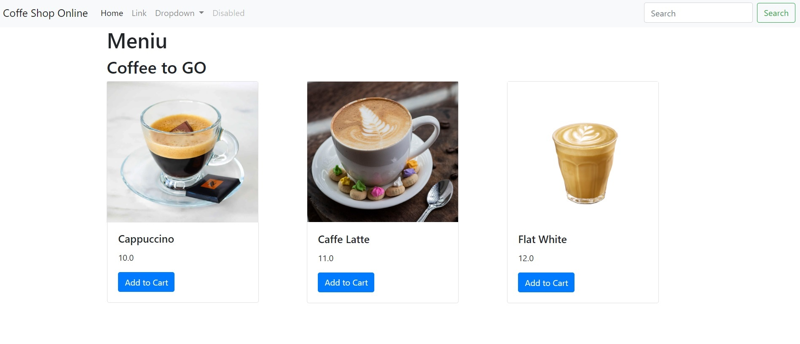

###  A Web server Coffee Shop Project in Django


#### New project  
    ```
    $ sudo dnf install python3-pip 
    $ pip install django 
    $ django-admin startproject coffeeshop .
    ```

##### After the profile was created, add the application with a different name than project name
    ```bash 
    $ python manage.py startapp coffee
    ```
    
##### Pip modules that are needed for Django
    ```bash
    $ python3 -m pip install -r requirements.txt
    ```

##### Backend Django
Migrate is pushing to configuration into the SqlLite database
    ```bash
    $ python manage.py makemigrations \
    $ python manage.py migrate
    ```

##### Create the administrator user for web interface
    ```bash
    $ python manage.py createsuperuser
    ```

###### Run the server to get access from all interfaces (external access to server) and forward to a reverse proxy server  
    ```bash 
    $ python3 manage.py runserver 0.0.0.0:8000
    ```
### Deployement with docker, docker compose   
##### Server runs in docker
    ```bash 
    $ docker compose up -d
    ```
